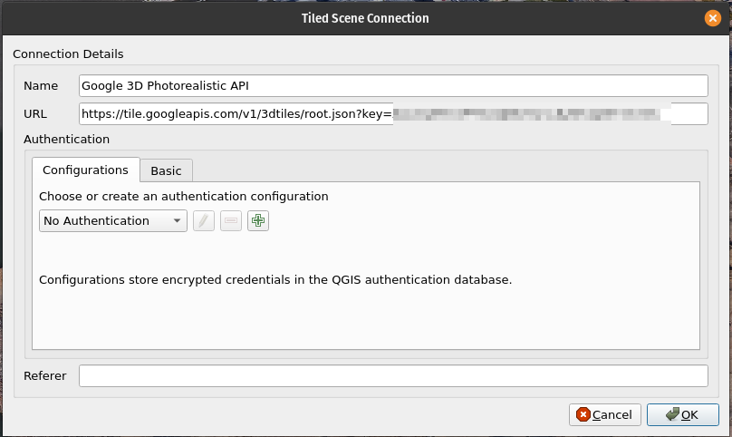

- Googlen 3D Photorealistic Data -aineistoa käyttääksesi tarvitset Googlelta API-avaimen. Hanki se:
https://developers.google.com/maps/documentation/tile/get-api-key
- Määritä projektille maantieteellinen/tilallinen laajuuus Project Properties -> View Settings -kohdasta. Käytä sopivaa aluetta, esim. kaupunginosaa. Määritä tämä "Set Project Full Extent" -kohdasta esim. Map Canvas Extentin avulla (tämä on pakollista, jotta QGIS ei lataa liikaa dataa / toimii) 
- Lisää Scenes-kohdasta uusi yhteys "New 3D tiles Cesium connection" ja muokkaa URLiin api-avain
https://tile.googleapis.com/v1/3dtiles/root.json?key=tähän-api-avain alla olevan kuvan mukaan

